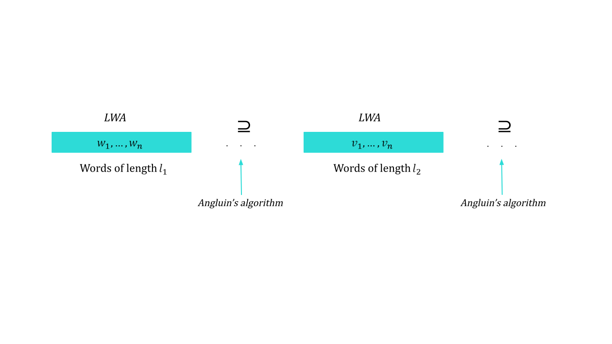

# Machine learning of patterns

## Installing
```
git clone https://github.com/julia-bel/machine_learning_of_patterns
pip install -r requirements.txt
```

> ### Basic algorithms
> - Lange and Wiehagen's pattern language learning algorithm: https://www.researchgate.net/publication/2464047.
> - Angulin's pattern language learning algorithm: https://www.sciencedirect.com/science/article/pii/0022000080900410.

## Algorithm
1) Let $L = \left \{ l_1, ..., l_k  \right \}$ be the ascending set of unique lengths of all dataset words.
2) Sequentially apply the Lange and Wiehagen's algorithm to the set of words of length $l_1, ..., l_k$.
3) If the pattern inclusion condition isn't satisfied, then apply the Angulin's algorithm to these patterns.
4) The result pattern corresponds to the minimum length words.

<p align="center">
    
</p>

## Learning
```
python main.py {dataset_path}
```
```dataset_path``` - path to a file with words for learning, separated by a line break character (default ```experiments/dataset.csv```).


## Files structure
```
.
|-- README.md
|-- assets
|   `-- readme visualizations
|-- automaton
|   |-- abstract_automaton.py - superclass for NFA and DFA
|   `-- automaton.py - implementation of NFA and DFA for regex matching
|-- experiments 
|   |-- matching_time.ipynb - notebook with time measurements
|   |-- two_steps_generation.ipynb - notebook for dataset creating
|   `-- dataset.csv - dataset regexes
|-- learning_algorithm
|   |-- angulin_learning.py - implementation of Angulin's algorithm
|   `-- lange_weihagen_learning.py - implementation of LWA
|-- pattern
|   |-- abstract_pattern.py - superclass for non-erasing pattern
|   `-- pattern.py - implementation of non-erasing pattern
|-- regex
|   |-- abstract_regex.py - superclass for regex 
|   |-- const.py - constants for regex module
|   |-- generator.py - generator of random regex
|   |-- parser.py - regex parser
|   `-- regex.py - implementation of regex
|-- utils
|   `-- utils.py - common utilities
|-- visualization
|   `-- *.gv, *.gv.png files for DFA, NFA and regex structure visualization
|-- requirements.txt
`-- main.py - script for patterns learning

```
